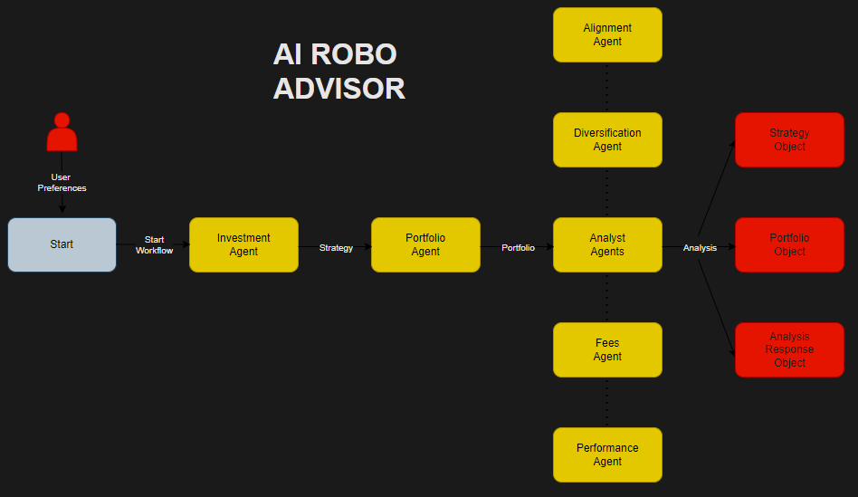

# 🤖 AI Robo Advisor

Welcome to your personal AI-powered investment assistant! This project aims to make professional-grade investment strategies, similar to those used by hedge funds, accessible to everyone through the power of AI.

This is the system workflow:

1. Investment Agent: collects user preferences via questionnaire and produces a structured Strategy.

2. Portfolio Agent: Translates the Strategy into a concrete ETF portfolio.

3. Analyst Agents:
    - Fees Agent: retrievesand analyze TER per holding.
    - Diversification Agent: compares and analyze portfolio vs strategy across asset class, geography, sector.
    - Alignment Agent: evaluates how holdings reflect risk tolerance, time horizon, expected returns embedded in the Strategy.
    - Performance Agent: computes CAGR, Annualized Volatility, Sharpe, Max Drawdown, Alpha, Beta and analyze if portfolio is performant.
    - Analysis Orchestrator: runs the above analyst agents and aggregates their outputs and provides a structured basis for downstream reporting.



> **Disclaimer:** This project is for educational and research purposes only. The information provided should not be considered financial advice. Investing in financial markets involves risk, and you should consult with a qualified professional before making any investment decisions.

## Key Features

*   **Web Interface:** Modern React application with interactive portfolio creation and analysis visualization
*   **AI-Driven Analysis:** Leverages AI to analyze market data and suggest investment strategies
*   **Portfolio Management:** Build and track investment portfolios through both web and CLI interfaces
*   **Real-Time Progress:** Live updates as AI agents work on your investment strategy
*   **Data Visualization:** Interactive charts for asset allocation, geographical diversification, and performance metrics
*   **Educational Tool:** Learn about both Langgraph and AI applications in finance

## Table of Contents
- [Installation](#installation)
- [How to Run](#how-to-run)
- [Contributing](#contributing)
- [License](#license)

## 🚀 Getting Started

Ready to run the project on your local machine? Follow these steps.

Note: 
- Portfolios are created with a maximum of 4 ETFs, and the analysis is performed using 2 years of historical data. These limitations are in place to work within the constraints of the free Polygon.io API key. If you have a paid license, you can modify the code to increase these limits.
- The  

### Installation

1.  **Clone the repository:**
    ```bash
    git clone https://github.com/matvix90/ai-robo-advisor.git
    cd ai-robo-advisor
    ```

2.  **Create a virtual environment (recommended):**
    ```bash
    python3 -m venv venv
    source venv/bin/activate
    ```

3.  **Install the dependencies:**
    ```bash
    pip install -e .
    ```

4. **Create a `.env` file for your API keys:**
    ```bash
    # Create .env file for your API keys (in the root directory)
    cp .env.example .env
    ```

5.  **Set up API Keys:**
    ```bash
    # For running LLMs
    OPENAI_API_KEY=your-openai-api-key

    # For getting financial data to power the robo advisor
    POLYGON_API_KEY=your-polygon-api-key
    ```

    **Important**: 
    - You must set at least one LLM API key (e.g. OPENAI_API_KEY, GOOGLE_API_KEY or ANTHROPIC_API_KEY) for the robo advisor to work.
    - You must set POLYGON_API_KEY for the robo advisor to work.

## How to Run

### 🌐 Web Interface (NEW!)
Experience the AI Robo Advisor through a modern, user-friendly web interface built with React.

1. **Navigate to the frontend directory:**
   ```bash
   cd frontend
   ```

2. **Install dependencies:**
   ```bash
   npm install
   ```

3. **Start the development server:**
   ```bash
   npm run dev
   ```

4. **Open your browser:**
   Navigate to `http://localhost:5173`

The web interface provides:
- Interactive portfolio creation wizard
- Real-time analysis progress indicators
- Beautiful data visualizations with charts
- Responsive design for mobile and desktop
- User authentication and dashboard

See the [frontend README](frontend/README.md) for more details.

### ⌨️ Command Line Interface
You can also run the AI Robo Advisor directly via terminal. This approach offers more granular control and is useful for automation, scripting, and integration purposes.


#### Run the AI Robo Advisor
```bash
run-advisor
```

You can also specify a `--show-reasoning` flag to run the AI Robo Advisor seeing agents reasoning.

```bash
run-advisor --show-reasoning
```

#### Example Analysis Response


## Contributing

Contributions are what make the open-source community such an amazing place to learn, inspire, and create. Any contributions you make are **greatly appreciated**.

If you have a suggestion that would make this better, please fork the repo and create a pull request. You can also simply open an issue with the tag  `enhancement`.

See `CONTRIBUTING.md` for detailed information.

## License

This project is distributed under the MIT License. See `LICENSE.txt` for more information.